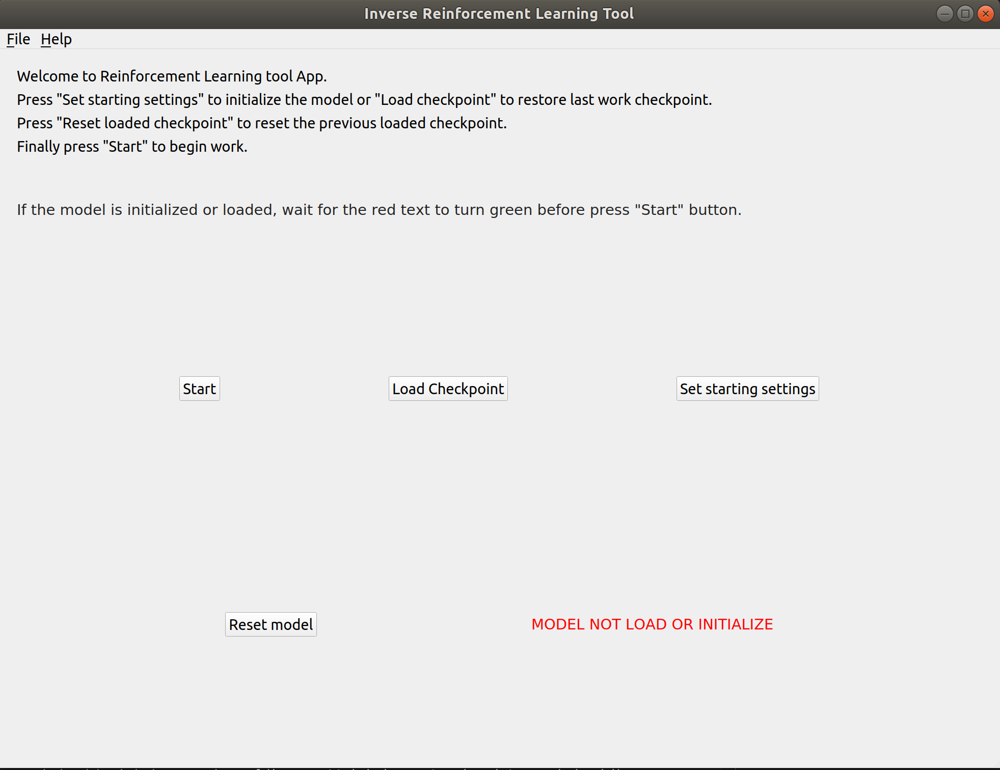
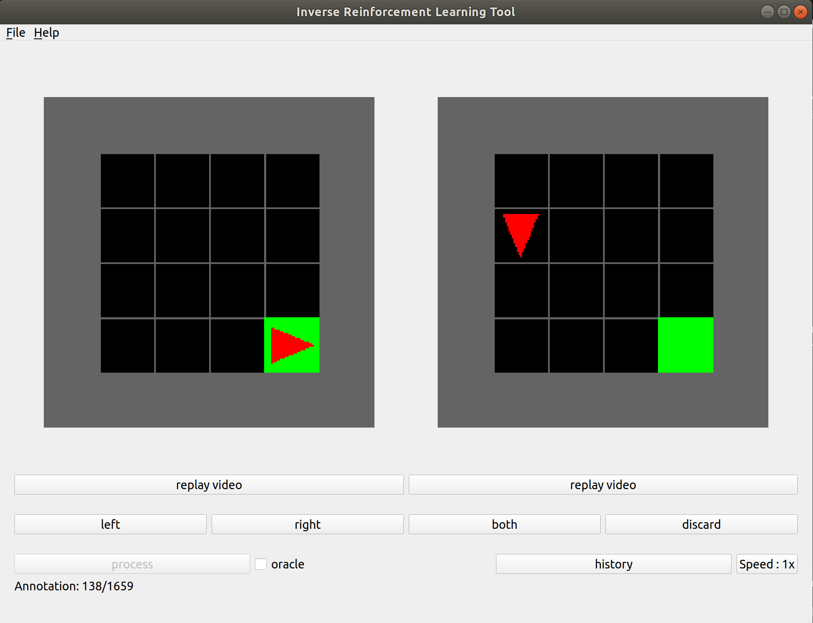

# Inverse Reinforcement Learning Application

<p align="center">
  
  
</p>

The aim of this project is to create a simple application that can give the opportunity to all the user to use the Inverse Reinforcement Learning technique. The application is implemented in Python and the interface is made entirely with PyQt5.

## Dependacies

- Pytorch
- NumPy
- OpenAI Gym
- Matplotlib 
- opencv
- PIL

For detailed steps to install PyTorch, follow the [PyTorch installation instruction](https://pytorch.org/get-started/locally/). A typical user can install PyTorch using the following commands:

```bash
# Create virtual environment
conda create -n minigrid python=3.7

# Activate virtual environment
conda activate minigrid

# Install OpenAI Gym
pip3 install gym-minigrid

# Install PyTorch
conda install pytorch torchvision cudatoolkit=10.1 -c pytorch
```

For detailed steps to install OpenAI Gym follow the Installation steps in [gym-minigrid github repository](https://github.com/maximecb/gym-minigrid).

The other packet can be installed using pip:


```bash
conda activate minigrid
pip install numpy
pip install mathplotlib
pip install Pillow
pip install opencv-python
```