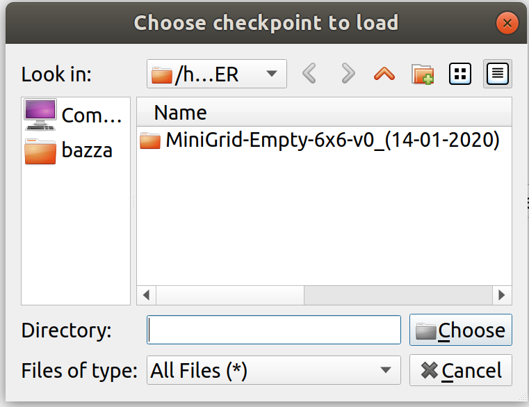

# Application Wdget

In this folder there are all the widget used to build he application view and functionality.

## Setup window

  

This window, wich is represented in the upper images, give the possibility to the user to initialize a new work. There the user can set different type of parameters:
- Minigrid env name that describe wich MiniGrid environment the user will use. Is possible to choose from 7 different type of environment:
`MiniGrid-Empty-6x6-v0`, `MiniGrid-Empty-16x16-v0`, `MiniGrid-Multiroom-N2-S4-v0`, `MiniGrid-Multiroom-N2-S5-v0`, `MiniGrid-Multiroom-N2-S6-v0`, `MiniGrid-Dynamic-Obstacle-6x6-v0` and `MiniGrid-Dynamic-Obstacle-16x16-v0`. (The description of all the environment is in the [MiniGrid github repository](https://github.com/maximecb/gym-minigrid)).

- Trajectory length describe the length of the trajectory that the policy has to create during each episodes.

- Reward Model learning rate is the reward model
learning rate. In this implementation, the [policy](../ReinforcementLearning/ReinforcemenLearning.md) and the [reward model](../ReinforcementLearning/ReinforcemenLearning.md) have different learning rate.

- Clips length define the clips length build from each trajectories.

- Train policy period is the number of episodes that the policy has to do and during which the single trajectory is divided in clips.

- Reward Model mini-batch is the number of mini-batch build from the annotation buffer build during the annotation phase to the training of the reward model.

- Annotation percentage define the number of pairs of clips that the user has to annotate. The number of pairs of clips depends on the number of clips generate during the policy train period.

All of this parameters can be setted manually or with the default button that set the default values, that can be seen in the image, for all the parameters.

  

  
  

