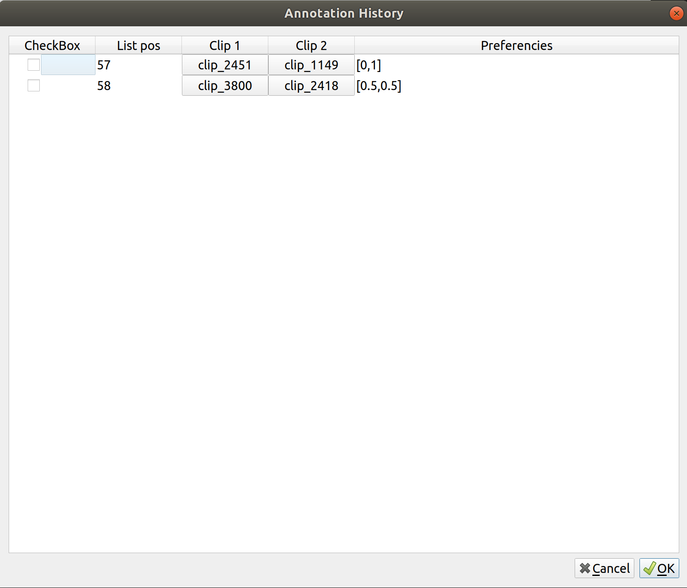
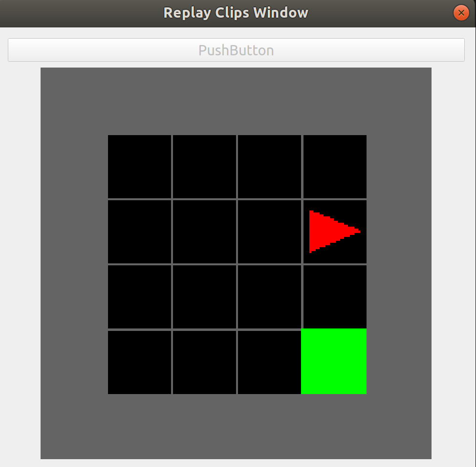

# Application Wdget

In this folder there are all the widgets used to build the application view and functionality. The most important widgets will be described below.

## Setup window

  

This window, which is represented in the upper image, give the possibility to the user to initialize a new work. There the user can set different type of parameters:
- Minigrid env name that describe which MiniGrid environment the user will use. Is possible to choose from 7 different type of environment:
`MiniGrid-Empty-6x6-v0`, `MiniGrid-Empty-16x16-v0`, `MiniGrid-Multiroom-N2-S4-v0`, `MiniGrid-Multiroom-N2-S5-v0`, `MiniGrid-Multiroom-N2-S6-v0`, `MiniGrid-Dynamic-Obstacle-6x6-v0` and `MiniGrid-Dynamic-Obstacle-16x16-v0`. (The description of all the environment is in the [MiniGrid github repository](https://github.com/maximecb/gym-minigrid)).

- Trajectory length describe the length of the trajectory that the policy has to create during each episodes.

- Reward Model learning rate is the reward model
learning rate. In this implementation, the [policy](../ReinforcementLearning/ReinforcemenLearning.md) and the [reward model](../ReinforcementLearning/ReinforcemenLearning.md) have different learning rate.

- Clips length define the clips length build from each trajectories.

- Train policy period is the number of episodes that the policy has to do and during which the single trajectory is divided in clips.

- Reward Model mini-batch is the number of mini-batch create from the annotation buffer build during the annotation phase.

- Annotation percentage define the number of pairs of clips that the user has to annotate. The number of pairs of clips depends on the number of clips generate during the policy train period.

All of this parameters can be setted manually or with the default button that set the default values, that can be seen in the image, for all the parameters.

## Checkpoint Loader

Another important features is that the user can load the previous work checkpoint.

  

 This is made by choosing the folder that the user want to load.
Inside all folder in 'SAVE_FOLDER' directory, the user can find:

- annotation_buffer : is a directory where there are saved all the triple ([clip a, clip b, preference]) in the annotation buffer during the work.

- values : is a csv that contain all the parameters and the information of the corresponding work.

- policy_weight : a .pth file which is the weight of the policy.

- csv_reward_model : a .pth file which is the weight of the reward model.

N.B : when the user start initialize the model for the first time and start the application, the previous file are not saved. They are automatically saved in some checkpoint, to make manula save click 'File/Save State' from the bar.

## History Window

The Hisory Window Widget is used during the annotation phase and store all the triple ([[clip a, clip b, preference]) which are inside the annotation buffer in real time.

  

This Widget is structured in 4 column where

| CheckBox | List pos | Clip 1 | Clip 2 | Preferencies |
| :---: | :---: | :---: | :---: | :---: |
|  |  |  |  |  |

- List Pos indicates the triple position in annotation buffer.
- Clip 1 and Clip 2 are two button that describe the two clips in the triple. When the user click the button appear a replay window with which the user can see the clip.

  

- Preferencies that define the user preference.

- CheckBox that is uset by the user to select all the triples which have a wrong annotation. This permits to the user to give the correct annotation to these triples.

